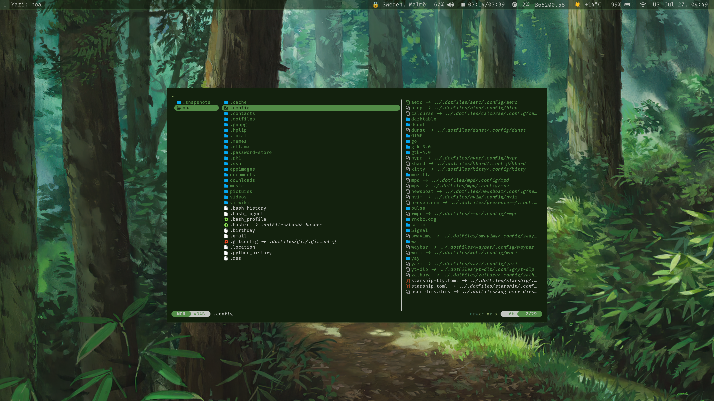

# Noa’s Dots
## Arch X Hyprland Rice

I use macOS for music and video production, but everything else—writing, photo editing, email, and so on—is done on my custom Linux system.
It's a relatively lightweight setup that consists mostly of FOSS CLI applications with Vim-like keybindings.

After installing Hyprland, Git, GNU Stow, and other necessary dependencies, you can install my configuration with:

```sh
git clone https://github.com/noalund/dots ~/.dotfiles
cd ~/.dotfiles && rm -f ~/.bashrc && mkdir -p ~/.config && stow .
```

## Scripts

I also maintain a separate repository containing the scripts I use alongside this setup, which can be cloned as follows:

```sh
rm -rf ~/.local/bin
git clone https://github.com/noalund/scripts ~/.local/bin
```
